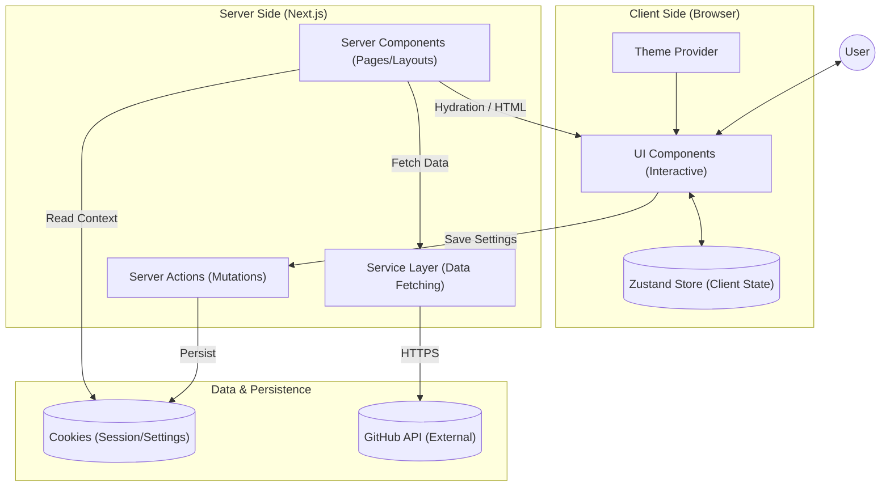
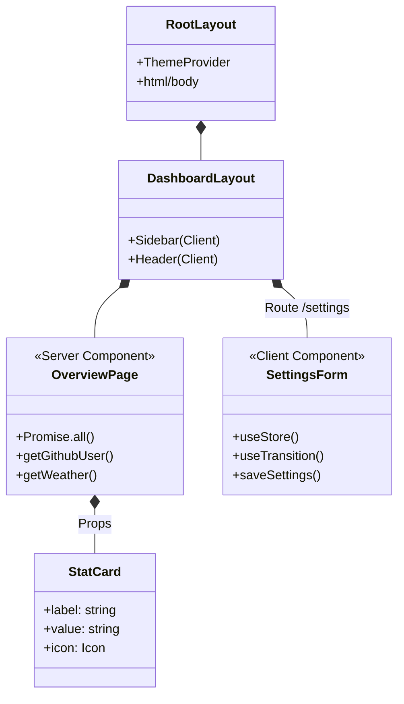
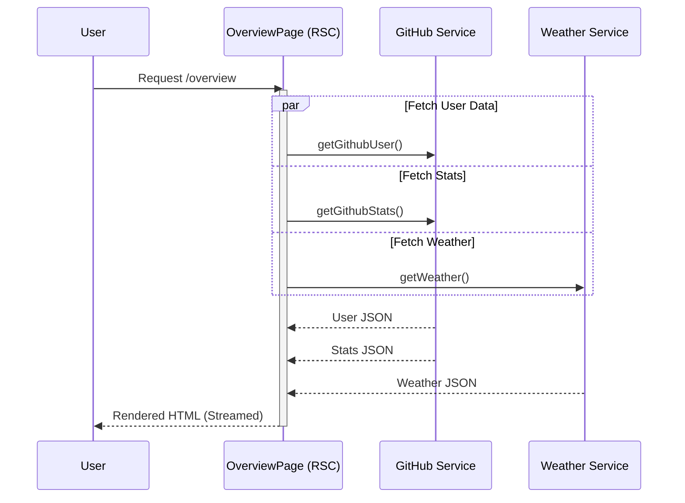
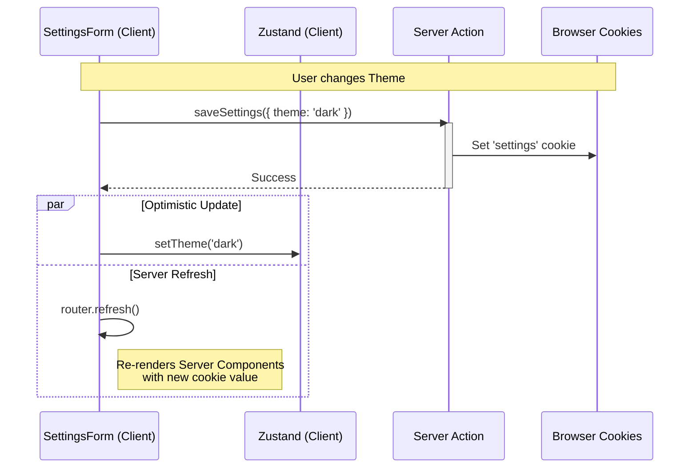
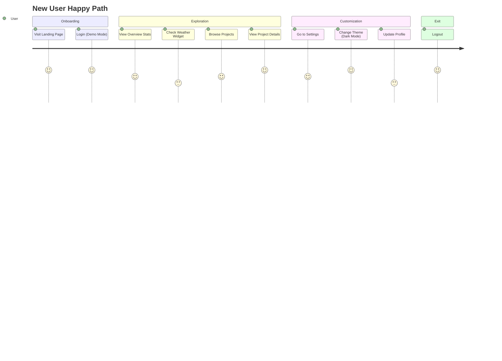

# Dev Control Dashboard

A modern, high-performance developer dashboard built with Next.js 15, React 19, and Tailwind CSS v4. This application provides a centralized view of your GitHub activity, project statistics, and system status with a premium, customizable UI.


## 💡 Key Learnings & Concepts

This project serves as a practical implementation of modern frontend engineering best practices.

### 1. Next.js App Router Architecture
*   **Server Components (RSC)**: Used by default for pages (`/overview`, `/projects`) to fetch data directly on the server. This reduces the client bundle size and improves initial load performance.
*   **Client Components**: Explicitly marked with `'use client'` for interactive elements like the **Settings Form**, **Sidebar**, and **Charts**.
*   **Nested Layouts**: The `/settings` route uses a nested `layout.tsx` to persist the side navigation while changing the content area.
*   **Dynamic Routing**: The `/projects/[id]` route demonstrates how to handle dynamic URL parameters to render specific project details.

### 2. Hybrid State Management (Zustand + Cookies)
*   **Zustand (Global Client State)**: Used for UI state (sidebar toggle), authentication status, and caching user preferences. It's configured with `persist` middleware to save state to `localStorage`.
*   **Cookies (Server State)**: We implemented a **Server Action** pattern (`saveSettings`) to store user preferences (theme, username) in cookies. This allows Server Components to read these settings *before* rendering HTML, preventing hydration mismatches.
*   **State Synchronization**: We manually sync the server-side cookie state with the client-side Zustand store to ensure consistency across the app.

### 3. Advanced Data Fetching
*   **Parallel Data Fetching**: In the `OverviewPage`, we use `Promise.all([])` to fetch User Data, Weather, Stats, and Events simultaneously. This prevents "waterfalls" (waiting for one request to finish before starting the next) and significantly speeds up page loads.
*   **Server Actions**: Used for mutations (saving settings). This allows us to execute server-side logic (setting cookies) directly from client components without creating a separate API route.

### 4. Styling & Theming System
*   **Tailwind CSS v4**: We are using the latest version of Tailwind with the new `@theme` configuration.
*   **CSS Variables Strategy**: We defined semantic color variables (e.g., `--background`, `--foreground`) in `globals.css`.
*   **Custom Theme Engine**: Instead of a library, we built a custom `ThemeProvider` that:
    *   Supports **Light**, **Dark**, and **System** modes.
    *   Uses `window.matchMedia` to listen for OS-level theme changes in real-time.
    *   Leverages CSS specificity (`:root.dark`) to instantly switch themes without flashing.

### 5. Performance & UX Patterns
*   **Optimistic UI**: In the settings forms, we use React's `useTransition` hook. This keeps the UI responsive (allowing the user to click other things) while the "Save" action is processing in the background.
*   **Mocking Strategy**: We implemented a robust service layer (`mock-api.ts`) that simulates network delays. This allows you to develop and test loading states without needing a real backend.

### 6. Component Design
*   **Atomic Design**: Small, reusable UI components (`Card`, `Button`, `Input`) are separated from business logic.
*   **Composition**: Complex pages are built by composing these smaller atomic components.

## 📖 Usage Guide

### 1. Dashboard Overview
The landing page provides a snapshot of your developer life.
- **Stats Cards**: Quick metrics on followers, repos, and contributions.
- **Activity Feed**: Recent GitHub events (pushes, PRs, issues).
- **Weather Widget**: Local weather based on your settings.

### 2. Managing Projects
Navigate to the **Projects** tab to see your repositories.
- **Search & Filter**: Quickly find specific projects.
- **Project Details**: Click "View Details" on any project to see deep stats like star history, language breakdown, and open issues.

### 3. Analytics
The **Analytics** page offers visual insights.
- **Commit History**: A bar chart showing your contribution activity over time.
- **Language Distribution**: A pie chart breaking down your most used programming languages.

### 4. Customizing Settings
Go to the **Settings** page to personalize your experience.

- **General**:
  - **Theme**: Toggle between Light, Dark, or System mode.
  - **GitHub Username**: Change the username to fetch data for a different account.
  - **City**: Update your location for the weather widget.
  
- **Profile**:
  - Edit your display name and email.
  - *Note: In this demo, these changes persist locally.*

- **Notifications**:
  - Toggle email, push, and digest preferences.
  - Settings are saved and persist across sessions.

- **Security**:
  - **Change Password**: Mock functionality to demonstrate UI states.
  - **2FA**: Toggle two-factor authentication.
  - **Danger Zone**: Mock account deletion flow.

## 📂 Project Structure

```
src/
├── app/                 # Next.js App Router pages
│   ├── (dashboard)/     # Main dashboard layout group
│   │   ├── overview/    # Dashboard home
│   │   ├── projects/    # Project listing & details
│   │   ├── analytics/   # Charts & stats
│   │   └── settings/    # Settings pages
│   └── layout.tsx       # Root layout with ThemeProvider
├── components/          # Reusable UI components
│   ├── cards/           # Dashboard widgets
│   ├── charts/          # Recharts wrappers
│   ├── layout/          # Shell, Sidebar, Header
│   └── ui/              # Atomic design elements (Button, Input, etc.)
├── lib/                 # Utilities & Server Actions
│   └── settings.ts      # Cookie-based settings sync
├── services/            # Data fetching
│   ├── github.ts        # GitHub API client
│   └── mock-api.ts      # Mock data for demo mode
└── store/               # Zustand global state
```

## 🏗️ High-Level Design




## 🧩 Low-Level Design (LLD)

### 1. Component Hierarchy & Data Flow

This diagram illustrates how data flows from Server Components down to Client Components and how state is managed.



### 2. Data Fetching Strategy (Parallelization)

We use `Promise.all` in Server Components to avoid waterfalls.



### 3. Settings Synchronization (Hybrid State)

Ensures server renders with correct settings (no hydration mismatch) while client remains interactive.




## User Journey Map

This diagram represents the "Happy Path" of a new user exploring the dashboard.



## 📄 License

This project is licensed under the MIT License.